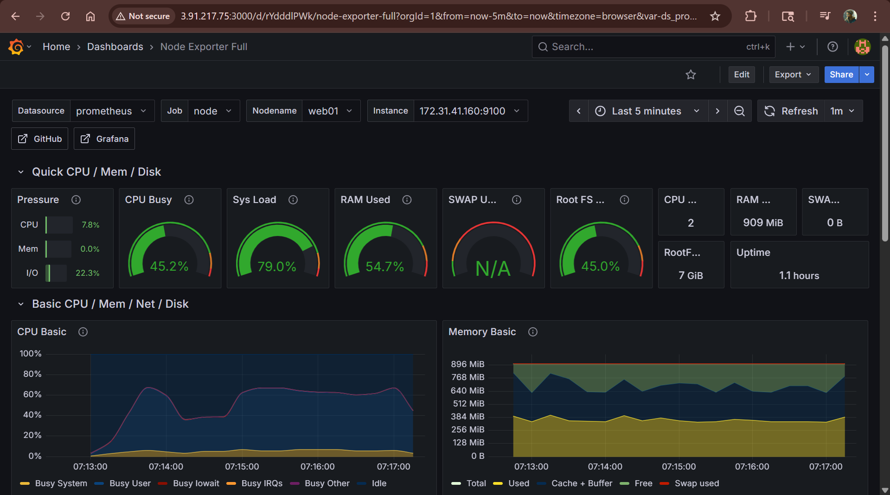
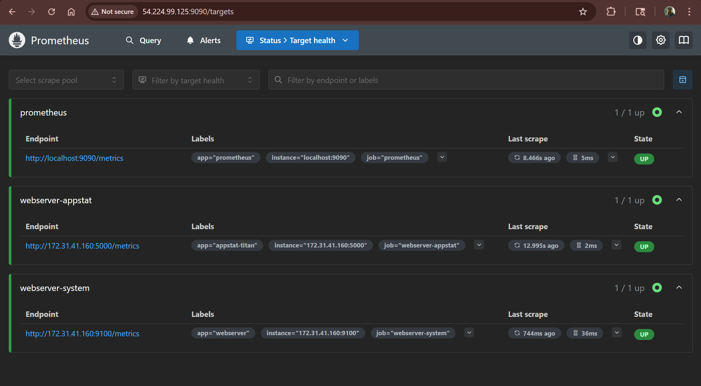
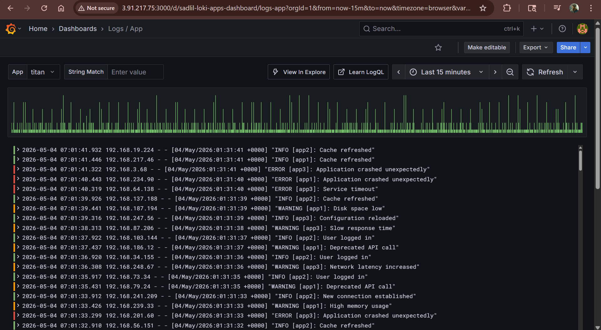
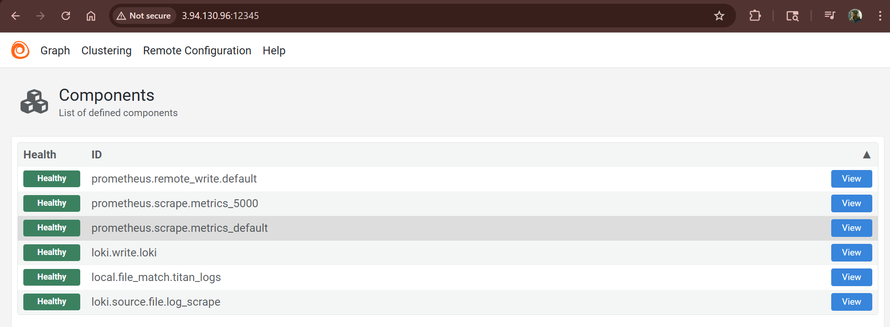
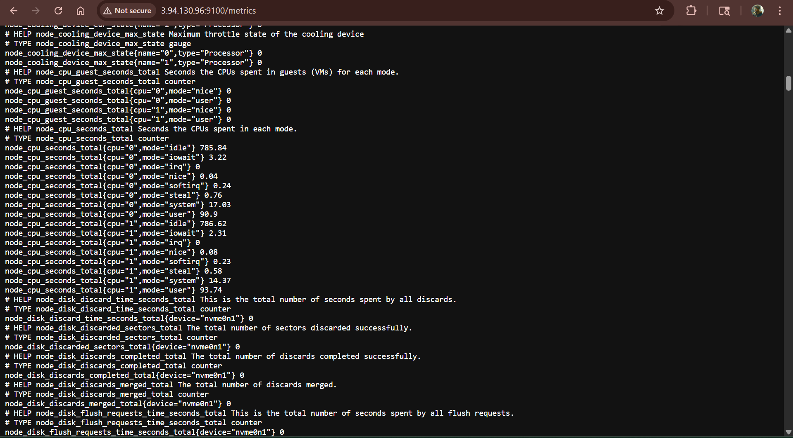

# 📡 EC2 Observability Stack — Prometheus · Loki · Grafana · Alloy

> A production-style monitoring setup deployed across **4 dedicated Ubuntu EC2 instances** on AWS.  
> Metrics are collected via Node Exporter → Prometheus, logs are shipped via Grafana Alloy → Loki, and everything is visualized in Grafana.

---

## 📌 Table of Contents

- [Architecture Overview](#architecture-overview)
- [Port Reference](#port-reference)
- [Infrastructure](#infrastructure)
- [Setup Guide](#setup-guide)
  - [1. Prometheus Server](#1-prometheus-server)
  - [2. Loki Server](#2-loki-server)
  - [3. Grafana Server](#3-grafana-server)
  - [4. Web / App Server](#4-web--app-server)
- [Manual Configuration Steps](#manual-configuration-steps)
- [Grafana Datasource Setup](#grafana-datasource-setup)
- [Grafana Dashboard Import](#grafana-dashboard-import)
- [Screenshots](#screenshots)
- [Tech Stack](#tech-stack)

---

## 🏗️ Architecture Overview

```
┌─────────────────────────────────────────────────────────────────┐
│                      Application Server (EC2)                   │
│                                                                  │
│   ┌──────────────────────┐     ┌──────────────────────────────┐  │
│   │  Titan Flask App     │     │  Node Exporter  (port 9100)  │  │
│   │  (port 5000)         │     │  Grafana Alloy  (port 12345) │  │
│   └──────────────────────┘     └──────────┬───────────────────┘  │
│                                          │                       │
└──────────────────────────────────────────┼───────────────────────┘
                          ┌────────────────┴─────────────────┐
                          │                                   │
                    Metrics (Flow)                      Logs push
                          │                                   │
                          ▼                                   ▼
              ┌───────────────────┐              ┌──────────────────┐
              │  Prometheus EC2   │              │    Loki EC2      │
              │  port: 9090       │              │    port: 3100    │
              └────────┬──────────┘              └────────┬─────────┘
                       │                                   │
                       │   PromQL Query                    │  LogQL Query
                       └──────────────┐   ┌───────────────┘
                                      ▼   ▼
                              ┌─────────────────┐
                              │   Grafana EC2   │
                              │   port: 3000    │
                              │  (Dashboards)   │
                              └─────────────────┘
```

**Data Flow:**
- **Metrics:** `Node Exporter` exposes system metrics → `Prometheus` scrapes → `Grafana` queries via PromQL
- **Logs:** `Grafana Alloy` collects app/system logs → pushes to `Loki` → `Grafana` queries via LogQL

---

## 🔌 Port Reference

| Service | EC2 | Port | Protocol | Access |
|---|---|---|---|---|
| Grafana UI | Grafana EC2 | 3000 | TCP | Admin IPs / VPN |
| Prometheus UI | Prometheus EC2 | 9090 | TCP | Admin IPs + Grafana EC2 |
| Loki API | Loki EC2 | 3100 | TCP | Alloy (App EC2) + Grafana EC2 |
| Node Exporter | App EC2 | 9100 | TCP | Prometheus EC2 |
| Grafana Alloy UI | App EC2 | 12345 | TCP | Admin IPs / VPN |
| Titan Flask App | App EC2 | 5000 | TCP | Internet / Users |

> ⚠️ **Security Note:** Restrict port 9090, 9100, 3100, 12345 access to internal EC2 IPs only via Security Groups. Port 3000 should be Admin/VPN only.

---

## 🖥️ Infrastructure

| Server | Role | Key Services |
|---|---|---|
| **App EC2** | Titan Flask App (port 5000) | Node Exporter, Grafana Alloy |
| **Prometheus EC2** | Metrics storage & scraping | Prometheus |
| **Loki EC2** | Log aggregation | Loki |
| **Grafana EC2** | Visualization & dashboards | Grafana |

All servers: **Ubuntu 22.04 LTS** on AWS EC2

---

## 🚀 Setup Guide

> Each server has a dedicated Bash script that installs the required component and registers it as a **systemd service** (auto-starts on reboot).

---

### 1. Prometheus Server

```bash
# SSH into Prometheus EC2
ssh -i your-key.pem ubuntu@<PROMETHEUS-EC2-IP>

# Clone the repo
git clone https://github.com/<your-username>/devops-projects.git
cd devops-projects/monitoring/ec2-prometheus-loki-grafana-alloy

# Run setup script
chmod +x prometheus-setup.sh
sudo ./prometheus-setup.sh
```

**What the script does:**
- Downloads Prometheus binary
- Creates `prometheus` system user
- Places config at `/etc/prometheus/prometheus.yml`
- Registers and starts `prometheus.service` via systemd

**Verify:**
```bash
sudo systemctl status prometheus
curl http://localhost:9090/-/healthy
```

---

### 2. Loki Server

```bash
# SSH into Loki EC2
ssh -i your-key.pem ubuntu@<LOKI-EC2-IP>

cd devops-projects/monitoring/ec2-prometheus-loki-grafana-alloy

chmod +x lokisetup.sh
sudo ./lokisetup.sh
```

**What the script does:**
- Downloads Loki binary
- Places default config at `/etc/loki/loki-config.yml`
- Registers and starts `loki.service` via systemd

**Verify:**
```bash
sudo systemctl status loki
curl http://localhost:3100/ready
```

---

### 3. Grafana Server

```bash
# SSH into Grafana EC2
ssh -i your-key.pem ubuntu@<GRAFANA-EC2-IP>

cd devops-projects/monitoring/ec2-prometheus-loki-grafana-alloy

chmod +x grafana-setup.sh
sudo ./grafana-setup.sh
```

**What the script does:**
- Adds Grafana APT repository
- Installs Grafana OSS
- Enables and starts `grafana-server.service` via systemd

**Verify:**
```bash
sudo systemctl status grafana-server
# Access UI: http://<GRAFANA-EC2-IP>:3000
# Default login: admin / admin
```

---

### 4. Web / App Server

```bash
# SSH into App EC2
ssh -i your-key.pem ubuntu@<APP-EC2-IP>

cd devops-projects/monitoring/ec2-prometheus-loki-grafana-alloy

chmod +x webnode_setup.sh
sudo ./webnode_setup.sh
```

**What the script does:**
- Installs **Node Exporter** → systemd service (port `9100`)
- Installs **Grafana Alloy** → systemd service (UI port `12345`)
- Places `config-alloy` and `alloy-defaults` config files

**Verify:**
```bash
sudo systemctl status alloy
sudo systemctl status node_exporter

# Node Exporter metrics
curl http://localhost:9100/metrics

# Alloy UI (from browser)
# http://<APP-EC2-IP>:12345
```

> ⚠️ **Manual config required before starting Alloy** — see section below.

---

## ✏️ Manual Configuration Steps

After running scripts, update these files with actual IPs:

### `config-alloy` — on App EC2

```hcl
# Update Prometheus remote_write URL
prometheus.remote_write "local" {
  endpoint {
    url = "http://<PROMETHEUS-EC2-PRIVATE-IP>:9090/api/v1/write"
  }
}

# Update Loki write URL
loki.write "local" {
  endpoint {
    url = "http://<LOKI-EC2-PRIVATE-IP>:3100/loki/api/v1/push"
  }
}
```

### `prometheus.yml` — on Prometheus EC2

```yaml
scrape_configs:
  - job_name: "node-exporter"
    static_configs:
      - targets:
          - "<APP-EC2-PRIVATE-IP>:9100"   # ← Add your App server IP here
```

After editing, restart the services:

```bash
# On App EC2
sudo systemctl restart alloy

# On Prometheus EC2
sudo systemctl restart prometheus
```

---

## 📊 Grafana Datasource Setup

Open Grafana UI → `http://<GRAFANA-EC2-IP>:3000`  
Login: `admin / admin` (change on first login)

**Add Prometheus datasource:**
1. Go to **Connections → Data Sources → Add new**
2. Select **Prometheus**
3. URL: `http://<PROMETHEUS-EC2-PRIVATE-IP>:9090`
4. Click **Save & Test** ✅

**Add Loki datasource:**
1. Go to **Connections → Data Sources → Add new**
2. Select **Loki**
3. URL: `http://<LOKI-EC2-PRIVATE-IP>:3100`
4. Click **Save & Test** ✅

---

## 📈 Grafana Dashboard Import

Import community dashboards for instant visibility:

| Dashboard | Grafana ID | Datasource |
|---|---|---|
| Node Exporter Full | `1860` | Prometheus |
| Loki Log Dashboard | `13639` | Loki |

**Steps:**
1. Grafana → **Dashboards → Import**
2. Enter the Dashboard ID
3. Select the correct datasource
4. Click **Import**

---

## 📸 Screenshots

### How to add screenshots to this README

**Step 1 — Create the folder in your repo:**
```
ec2-prometheus-loki-grafana-alloy/
└── screenshots/
    ├── grafana-home.png
    ├── node-exporter-dashboard.png
    ├── loki-logs.png
    └── prometheus-targets.png
```

**Step 2 — Take screenshots of these pages:**

| What to capture | URL |
|---|---|
| Grafana Home / Dashboard list | `http://<GRAFANA-IP>:3000` |
| Node Exporter Full dashboard | Grafana → Dashboard ID 1860 |
| Loki Logs Explorer | Grafana → Explore → Loki |
| Prometheus Targets (all UP) | `http://<PROMETHEUS-IP>:9090/targets` |
| Alloy UI / Pipeline graph | `http://<APP-IP>:12345` |
| Titan Flask App running | `http://<APP-IP>:5000` |

**Step 3 — Upload & embed in README:**

```bash
# Upload via GitHub UI:
# Go to your repo → screenshots/ folder → "Add file" → "Upload files"

# OR via git:
git add screenshots/
git commit -m "add: monitoring stack screenshots"
git push origin main
```

**Step 4 — Embed in README like this:**

```markdown
### Grafana Dashboard


### Prometheus Targets


### Loki Logs Explorer


### Alloy Pipeline UI

```

---

### Preview (add your actual screenshots below after setup)

| Dashboard | Preview |
|---|---|
| Grafana Home |  |
| Node Exporter Metrics |  |
| Loki Logs Explorer |  |
| Prometheus Targets |  |
| Alloy Pipeline UI |  |
| Titan Flask App |  |

---

## 🛠️ Tech Stack

| Tool | Purpose | Version |
|---|---|---|
| **AWS EC2** | Infrastructure (4x Ubuntu instances) | t2.micro / t3.small |
| **Prometheus** | Metrics collection & storage | Latest |
| **Grafana Alloy** | Log & metrics agent (replaces Promtail) | Latest |
| **Loki** | Log aggregation backend | Latest |
| **Grafana** | Visualization & alerting | OSS Latest |
| **Node Exporter** | System metrics exporter | Latest |
| **Titan Flask App** | Web application being monitored | Python/Flask |
| **Bash** | Automated setup scripts + systemd | — |

---

## 📁 File Reference

```
ec2-prometheus-loki-grafana-alloy/
├── titan/                    # Titan Flask application source
│   └── app.py                # Flask app (runs on port 5000)
├── prometheus-setup.sh       # Prometheus install + systemd
├── lokisetup.sh              # Loki install + systemd
├── grafana-setup.sh          # Grafana install + systemd
├── webnode_setup.sh          # Node Exporter + Alloy install
├── config-alloy              # Alloy pipeline config (update IPs here)
├── alloy-defaults            # Alloy env config (Alloy UI port: 12345)
├── promtail-config.yml       # Legacy Promtail config (reference)
├── WebsiteTest-main.sh       # Load test script - main endpoints
├── WebsiteTest-payment.sh    # Load test script - payment flow
├── generate_multi_logs.sh    # Log generation for testing
├── load.sh                   # General load generator
├── screenshots/              # Add your screenshots here
└── README.md                 # This file
```

---

## 👤 Author

**Rizwaan Rahat** — DevOps Engineer  
🔗 [LinkedIn](https://www.linkedin.com/in/rizwaan-khan/) · [GitHub](https://github.com/mr-rizwan-1)
